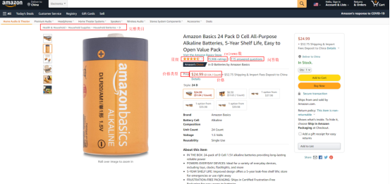
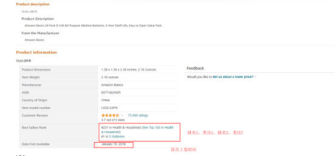
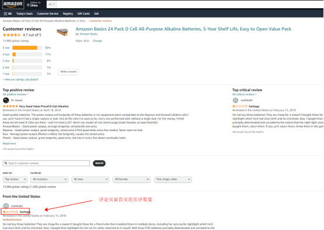

# 需求背景
根据固定的ASIN和站点信息，爬取对应亚马逊网站的ASIN详情页面的数据。目前已实现爬取的站点共9个：US,CA,MX,DE,IT,FR,ES,UK,JP。
# 项目环境初始化
1、搭建mysql库，建库DDL见`mysql_ddl.sql`。mysql数据库连接信息请配置`settings.py`。

2、python版本，Python 3.6.8

3、手动配置cookie信息，修改`settings.py`中的`cookie_*`值，可以添加多个cookie值。根据亚马逊网站特性，cookie信息有效期一般能用6个月，除非网站有较大改动，cookie失效时需重新手动更新。

# 爬取信息
| 爬取字段 |
|---|
| 首图链接  |
| ASIN |
| 站点  |
| 品牌  |
| 产品名称  |
| 完整类目  |
| 星级  |
| review数量  |
| QA问答数  |
| 价格（原币）  |
| 排名1  |
| 类目1  |
| 排名2  |
| 类目2  |
| FBA标识  |
| 首次上架时间  |
| 产品卖点  |
| Coupon  |





# 项目运行
以下2个办法均可以运行程序

1、编译环境，运行`main.py`文件

2、进入项目目录下，命令行执行`scrapy crawl amazon_crawl`
```
cd ./amazon_spider
scrapy crawl amazon_crawl
```